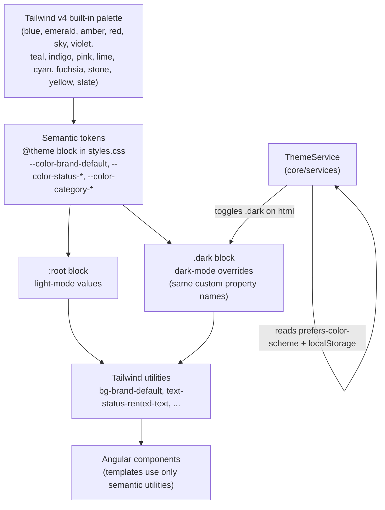

# Color Design System Design

**Spec**: `.specs/features/color-system/spec.md`
**Context**: `.specs/features/color-system/context.md`
**Status**: Draft

---

## Architecture Overview

A three-layer token model, entirely CSS-native (no `tailwind.config.js`, per Tailwind v4's CSS-first config), living in `src/styles.css`:

1. **Primitives** — raw color scales (50–950). We do **not** hand-roll these: Tailwind v4 already ships ~22 OKLCH-based color families (`blue`, `orange`, `slate`, `emerald`, `amber`, `red`, `sky`, `violet`, `teal`, `indigo`, `pink`, `lime`, `cyan`, `fuchsia`, `stone`, `yellow`, ...) the moment `@import "tailwindcss";` runs. We reuse these directly as primitives instead of redefining hex values — less to maintain, and they're already perceptually-tuned.
2. **Semantic tokens** — meaningful names (`brand`, `accent`, `success`, `status-available`, `category-1`, ...) each pointing at a specific primitive step. Declared once in `@theme` (so Tailwind auto-generates utilities like `bg-brand-default`, `text-status-overdue-text`) and re-pointed per color-scheme in `:root` / `.dark`.
3. **Consumption** — components use only semantic utility classes (`bg-brand-default`, `text-status-available-text`). Never a raw primitive (`bg-blue-600`) or hex in component code, per COLOR-01 and the CLAUDE.md Tailwind-first convention.



**Dark mode mechanism**: class-based, via Tailwind v4's `@custom-variant`:

```css
@custom-variant dark (&:where(.dark, .dark *));
```

This is the agent's discretion call from `context.md` — chosen over OS-preference-only because it lets a future `ThemeService` offer a manual toggle while still defaulting to `prefers-color-scheme` (the service applies `.dark` to `<html>` on load based on OS preference, then persists any manual override to `localStorage`). Every semantic custom property is defined once in `:root` (light) and re-declared with different values inside `.dark { }` — components never need a `dark:` prefix because the same utility class (e.g. `bg-brand-default`) resolves to a different CSS variable value depending on whether `.dark` is an ancestor. This directly satisfies COLOR-02 AC2.

---

## Code Reuse Analysis

### Existing to leverage

| Component | Location | How to Use |
|---|---|---|
| Tailwind v4 default palette | `node_modules/tailwindcss` (built-in, via `@import "tailwindcss"`) | Reused as the entire primitive layer — no custom hex scales authored |
| `src/styles.css` | `src/styles.css` | This is where the `@theme`, `:root`, and `.dark` blocks are added |
| Tailwind-first / mobile-first conventions | `CLAUDE.md` | This design's utility-only consumption rule is a direct extension of that convention |
| Path aliases (`@shared/*`, `@core/*`) | `tsconfig.json` | `ThemeService` and `category-color.map.ts` (future implementation) will live under `@core` / `@shared` and be imported via alias, not relative paths |

### Integration points

| System | Integration Method |
|---|---|
| Tailwind v4 build (`@tailwindcss/postcss`) | Token declarations live in plain CSS (`@theme`, `@custom-variant`) — no build config changes needed beyond what already exists in `.postcssrc.json` |
| Future `shared/ui` components (button, chip, table, form-dialog per `estrutura.md`) | Will consume semantic tokens exclusively once built — this design doesn't build those components, only the tokens they'll use |
| SSR (`@angular/ssr`) | Dark mode must not cause a light→dark flash on hydration; `ThemeService` needs to read the persisted/OS preference before first paint (implementation detail for whoever builds `ThemeService` — flagged here, not solved by tokens alone) |

---

## Token Layers

### 1. Primitives (reused, not authored)

Tailwind v4 built-in families used as source primitives: `slate`, `blue`, `orange`, `emerald`, `amber`, `red`, `sky`, `violet`, `teal`, `indigo`, `pink`, `lime`, `cyan`, `fuchsia`, `stone`, `yellow` — each with steps `50…950`. No `@theme` overrides needed at this layer.

### 2. Semantic tokens

All declared as `--color-<name>` inside `@theme` (so `bg-<name>`, `text-<name>`, `border-<name>`, `ring-<name>` utilities are generated automatically), then given light values in `:root` and dark values in `.dark`.

#### Surface & text (neutral, `slate` family)

| Token | Light | Dark | Usage |
|---|---|---|---|
| `bg-canvas` | `slate-50` | `slate-950` | Page background |
| `bg-surface` | `white` | `slate-900` | Card / panel background |
| `bg-surface-raised` | `white` | `slate-800` | Modal, dropdown, popover |
| `bg-overlay` | `slate-950/50` | `slate-950/70` | Scrim behind modals |
| `text-primary` | `slate-900` | `slate-50` | Body/heading text |
| `text-secondary` | `slate-600` | `slate-300` | Supporting text |
| `text-muted` | `slate-400` | `slate-500` | Placeholders, hints |
| `text-disabled` | `slate-300` | `slate-600` | Disabled labels |
| `text-inverse` | `white` | `white` | Text on solid brand/accent/status backgrounds (mode-independent) |
| `border-default` | `slate-200` | `slate-800` | Default dividers/inputs |
| `border-strong` | `slate-300` | `slate-700` | Emphasized borders |
| `border-focus` | `blue-500` | `blue-400` | Focus rings |

#### Brand (blue — "trust & security")

| Token | Light | Dark |
|---|---|---|
| `brand-default` | `blue-600` | `blue-500` |
| `brand-hover` | `blue-700` | `blue-400` |
| `brand-active` | `blue-800` | `blue-300` |
| `brand-subtle-bg` | `blue-50` | `blue-950` |
| `brand-on-brand` | `white` | `white` |

#### Accent (orange — reserved for conversion CTAs only, per COLOR-05)

| Token | Light | Dark |
|---|---|---|
| `accent-default` | `orange-600` | `orange-500` |
| `accent-hover` | `orange-700` | `orange-400` |
| `accent-active` | `orange-800` | `orange-300` |
| `accent-subtle-bg` | `orange-50` | `orange-950` |
| `accent-on-accent` | `white` | `white` |

**Usage guardrail**: `accent-*` is exclusively for primary conversion actions ("Rent now", "Book", "Complete payment") and "featured" badges. It must not be used for navigation, links, or routine chrome — otherwise it loses its signal value (documented per COLOR-05 AC2).

#### Feedback states (generic — toasts, form validation, alerts)

Each state follows the same 4-slot shape: `-text` (inline text/icon), `-bg` (subtle banner background), `-border`, `-solid` (paired with `text-inverse` for solid badges/buttons).

| State | Family | `-text` (L/D) | `-bg` (L/D) | `-border` (L/D) | `-solid` (L/D) |
|---|---|---|---|---|---|
| `success` | emerald | `emerald-700` / `emerald-300` | `emerald-50` / `emerald-950` | `emerald-200` / `emerald-800` | `emerald-600` / `emerald-500` |
| `warning` | amber | `amber-800` / `amber-300` | `amber-50` / `amber-950` | `amber-200` / `amber-800` | `amber-500` / `amber-400` (pair with `text-primary`, **not** `text-inverse` — amber is too light for white text at AA, see Tech Decisions) |
| `error` | red | `red-700` / `red-300` | `red-50` / `red-950` | `red-200` / `red-800` | `red-600` / `red-500` |
| `info` | sky | `sky-700` / `sky-300` | `sky-50` / `sky-950` | `sky-200` / `sky-800` | `sky-600` / `sky-500` |

#### Rental/item status (dedicated, per COLOR-03 — distinct from generic feedback above)

Same 4-slot shape (`-text` / `-bg` / `-border` / `-solid`):

| Status | Family | `-text` (L/D) | `-bg` (L/D) | `-solid` (L/D) | Notes |
|---|---|---|---|---|---|
| `status-available` | emerald | `emerald-700` / `emerald-300` | `emerald-50` / `emerald-950` | `emerald-600` / `emerald-500` | Distinct token name from `success`, same hue — "available" *is* a positive state, reuse is intentional (spec allows tokens to share a resolved value, COLOR-01 AC3) |
| `status-reserved` | violet | `violet-700` / `violet-300` | `violet-50` / `violet-950` | `violet-600` / `violet-500` | New hue, not used elsewhere — "on hold, not yet active" |
| `status-rented` | amber | `amber-800` / `amber-300` | `amber-50` / `amber-950` | `amber-500` / `amber-400` (pair with `text-primary`) | "Active, time-bound" — shares hue with `warning` intentionally (same connotation), distinct token name |
| `status-unavailable` | slate | `slate-600` / `slate-400` | `slate-100` / `slate-800` | `slate-500` / `slate-500` | Muted/neutral — blocked or paused listings |
| `status-overdue` | red | `red-700` / `red-300` | `red-50` / `red-950` | `red-600` / `red-500` | Shares hue with `error` intentionally — pair with bold/emphasis styling (border-2, icon) at the component level, not a color concern |

#### Category badges (fixed 8 slots + neutral fallback, per COLOR-04)

Same `-text` / `-bg` shape (solid variant optional, only needed if a filled category chip style is ever used):

| Slot | Family | `-text` (L/D) | `-bg` (L/D) | Suggested category |
|---|---|---|---|---|
| `category-0` (fallback) | slate | `slate-700` / `slate-300` | `slate-100` / `slate-800` | Unmapped/unknown category |
| `category-1` | teal | `teal-800` / `teal-200` | `teal-100` / `teal-950` | Tools & Equipment |
| `category-2` | indigo | `indigo-800` / `indigo-200` | `indigo-100` / `indigo-950` | Electronics & Tech |
| `category-3` | pink | `pink-800` / `pink-200` | `pink-100` / `pink-950` | Fashion & Apparel |
| `category-4` | lime | `lime-800` / `lime-200` | `lime-100` / `lime-950` | Outdoor & Garden |
| `category-5` | cyan | `cyan-800` / `cyan-200` | `cyan-100` / `cyan-950` | Vehicles & Transport |
| `category-6` | fuchsia | `fuchsia-800` / `fuchsia-200` | `fuchsia-100` / `fuchsia-950` | Events & Party |
| `category-7` | stone | `stone-800` / `stone-200` | `stone-100` / `stone-950` | Real Estate & Spaces |
| `category-8` | yellow | `yellow-800` / `yellow-200` | `yellow-100` / `yellow-950` | Hobbies, Sports & Leisure |

**Assignment strategy** (satisfies COLOR-04 AC2): a single mapping file, `category-color.map.ts` (future, under `shared/constants/`), holds `categorySlug → slot (1-8)`. When a new category is added beyond the 8 curated ones, assign it `slot = (runningCategoryIndex % 8) + 1` (round-robin) rather than inventing a new token. Unknown/unmapped categories render `category-0`. **Category chips must always render an icon + text label alongside the color** — color is never the sole signal, both for scalability (slots will repeat past 8 categories) and for WCAG SC 1.4.1 (use of color).

---

## Components (future implementation — out of scope for this design's approval, listed for continuity)

### `styles.css` token block

- **Purpose**: Single source of truth for every token in this design
- **Location**: `src/styles.css`
- **Contains**: `@import "tailwindcss";`, `@custom-variant dark (...)`, `@theme { --color-*: ...; }`, `:root { --color-*: <light values>; }`, `.dark { --color-*: <dark values>; }`
- **Reuses**: Tailwind v4 built-in palette

### `ThemeService`

- **Purpose**: Own dark-mode activation — read `prefers-color-scheme`, read/write a `localStorage` override, toggle `.dark` on `document.documentElement`
- **Location**: `src/app/core/services/theme.service.ts`
- **Interfaces**:
  - `isDark(): Signal<boolean>` — current mode
  - `toggle(): void` — flips and persists override
  - `setMode(mode: 'light' | 'dark' | 'system'): void`
- **Dependencies**: `DOCUMENT` token (SSR-safe), `PLATFORM_ID` (skip `localStorage`/`matchMedia` on server)
- **Reuses**: none yet — first service of its kind

### `category-color.map.ts`

- **Purpose**: Single mapping of category slug → slot number (1-8), plus the round-robin fallback function
- **Location**: `src/app/shared/constants/category-color.map.ts`
- **Interfaces**: `getCategorySlot(categorySlug: string): number`
- **Reuses**: none yet

---

## Data Models

```typescript
type RentalStatus = 'available' | 'reserved' | 'rented' | 'unavailable' | 'overdue';

type FeedbackState = 'success' | 'warning' | 'error' | 'info';

interface CategoryColorSlot {
  slot: number; // 0 = fallback, 1-8 = curated slots
  textToken: string;   // e.g. 'category-1-text'
  bgToken: string;     // e.g. 'category-1-bg'
}
```

**Relationships**: `RentalStatus` maps 1:1 to the `status-*` semantic token group. `CategoryColorSlot` is resolved by `getCategorySlot()` from an arbitrary category slug string (no fixed enum, since categories are open-ended per "de tudo").

---

## Error Handling Strategy

| Scenario | Handling | User Impact |
|---|---|---|
| Category slug not in the curated map | `getCategorySlot()` falls back to round-robin assignment (or slot 0 if the round-robin index itself is unavailable) | Chip still renders with a color + label, never blank/unstyled |
| `prefers-color-scheme` unsupported / unavailable (old browser) | `ThemeService` defaults to light | App renders correctly, just not in the user's actual OS theme |
| SSR render before `ThemeService` runs client-side | Server renders with the light-mode `:root` defaults (no `.dark` class applied server-side) | Possible light→dark flash on hydration if the user's stored preference is dark — flagged as a follow-up implementation concern, not solved by the token layer itself |

---

## Tech Decisions

| Decision | Choice | Rationale |
|---|---|---|
| Primitive color source | Reuse Tailwind v4's built-in OKLCH palette instead of authoring custom hex scales | Less to maintain, perceptually-tuned already, zero extra config — Tailwind v4 ships these by default on `@import "tailwindcss"` (verified via web search against current Tailwind docs) |
| Dark mode activation | Class-based (`@custom-variant dark (&:where(.dark, .dark *))`) rather than `prefers-color-scheme`-only | Lets a future manual toggle coexist with OS-preference default; Tailwind v4's docs confirm this is the standard v4 pattern since `darkMode` config key no longer exists |
| Config file | None (`tailwind.config.js`) — everything lives in `styles.css` | Tailwind v4 is CSS-first; matches the "no extra build config" principle and keeps token definitions colocated with the rest of the global styles |
| `warning`/`status-rented` solid pairing | Pair with `text-primary` (dark text), not `text-inverse` (white) | Amber/yellow-family hues at a step light enough to read as "amber" don't reach AA contrast with white text on top — this is well-known Tailwind community guidance, not independently contrast-measured here; **flagged for verification with a contrast checker (e.g. WebAIM) before shipping**, per this spec's success criteria |
| Category color assignment | Fixed 8 curated slots + round-robin fallback, mapped via one config file | Directly addresses the scalability trade-off the user accepted when choosing color-per-category (context.md) — bounds token growth while still delivering the requested visual differentiation |
| Token naming | Flat semantic names in `@theme` (`--color-brand-default`, not nested like `--color-brand-default-light`) | Tailwind utilities are generated straight from the custom property name; keeping one name per concept (light/dark handled by cascade, not by name) is what makes "zero `dark:` classes in components" possible |

---

## Open Verification Item

Before implementation is marked done, every `-solid` / `-text`-on-`-bg` pairing in the tables above should be spot-checked with a contrast tool (WebAIM Contrast Checker or equivalent) against the actual Tailwind v4 OKLCH values, since this design reasons from well-established Tailwind shade conventions rather than independently computed ratios. Flag any pairing that fails AA and swap to an adjacent step.

---

## Tips carried into next phase

- If/when this moves to Tasks: the natural breakdown is (1) `styles.css` token block, (2) `ThemeService`, (3) `category-color.map.ts` + doc, (4) a contrast-verification pass.
- Everything here only touches `src/styles.css` + two small new files under `core/services` and `shared/constants` — small enough that Tasks could plausibly be skipped and this executed as one inline implementation pass, per the skill's auto-sizing rules.
