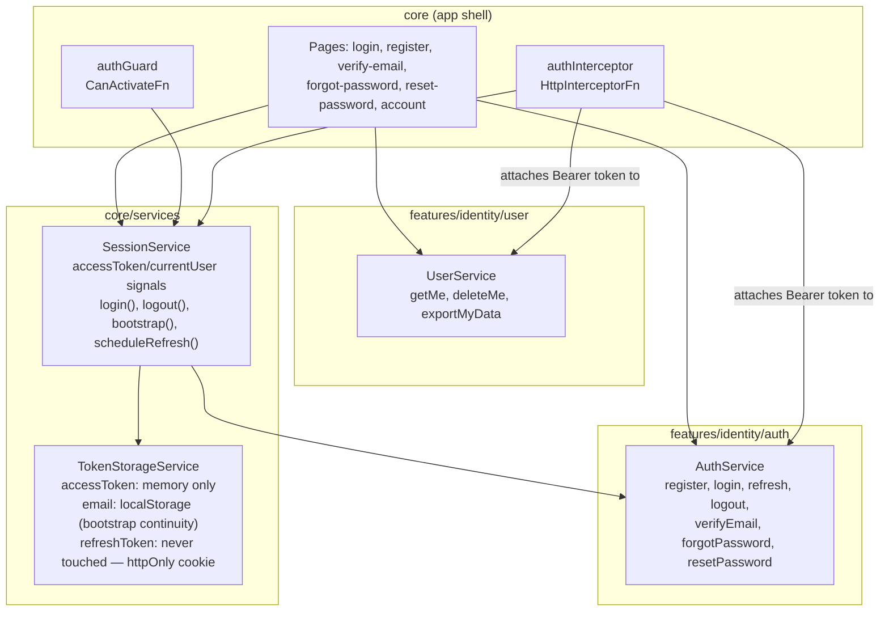
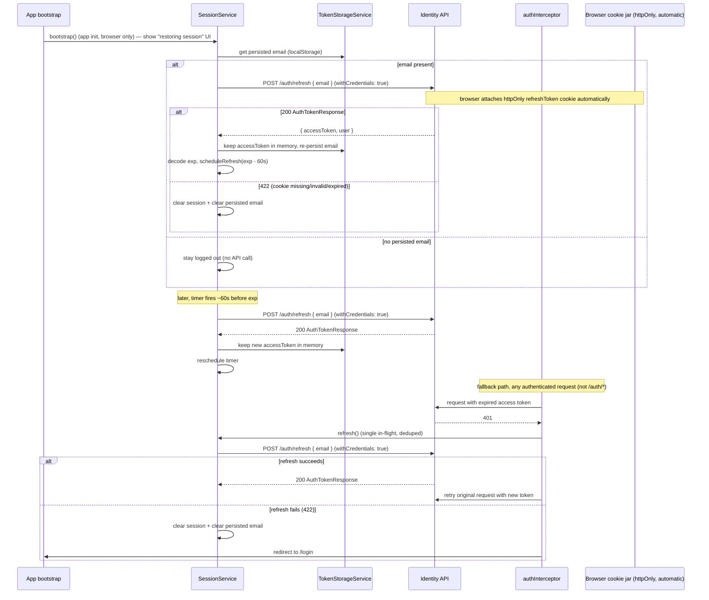

# Identity Design

**Spec**: `.specs/features/identity/spec.md`
**Context**: `.specs/features/identity/context.md`
**Status**: Revised 2026-07-11 — `api-contracts.md` changed to httpOnly refresh-token cookies (was: refresh token returned in the JSON body). This revision updates the architecture below; the original T1–T21 implementation predates it. See `.specs/features/identity/tasks.md` → "Migration: httpOnly Refresh-Token Cookie" for the concrete task breakdown bringing the code in line with this revision.

---

## Architecture Overview

Three layers, split across `core/` (cross-cutting session/route infra, per `CLAUDE.md`) and `features/identity/` (domain services + DTOs matching `api-contracts.md`):

1. **HTTP layer** (`features/identity/auth`, `features/identity/user`) — thin, stateless services that call the 9 endpoints in `api-contracts.md` and return typed Observables. No token/session logic lives here.
2. **Session layer** (`core/services`) — `SessionService` owns the current `accessToken` + current user as signals, orchestrates login/logout/refresh, and schedules the proactive refresh timer. `TokenStorageService` holds the `accessToken` in memory only and persists just the user's `email` in `localStorage` (non-sensitive, needed so `bootstrap()` knows who to ask `POST /auth/refresh` for after a reload — see `context.md` → "Email persistence for bootstrap"). The refresh token itself is never touched by frontend code at all — it lives in an `httpOnly` cookie the browser manages automatically.
3. **App-shell integration** (`core/guards`, `core/interceptors`, `core/pages`) — `authGuard` protects routes, `authInterceptor` attaches the bearer token and handles reactive refresh-on-401, and the public/authenticated pages consume `SessionService` + the HTTP-layer services.



### Token refresh sequence (proactive + reactive, per `context.md` — revised for the httpOnly cookie flow)



---

## Code Reuse Analysis

### Existing to leverage

| Component | Location | How to Use |
|---|---|---|
| Semantic color tokens (`bg-brand-default`, `text-status-*`, feedback tokens) | `src/styles.css` (color-system feature) | All auth pages/forms/badges use these exclusively — never a raw hex, per `CLAUDE.md` and `COLOR-01` |
| `ThemeService` pattern (`core/services/theme.service.ts`) | `src/app/core/services/` | Structural precedent: `SessionService`/`TokenStorageService` follow the same signal-based, SSR-safe (`PLATFORM_ID`/`DOCUMENT`-guarded) service style already established there |
| Path aliases (`@core/*`, `@features/*`, `@shared/*`) | `tsconfig.json` | All new imports across this feature use aliases, never deep relative paths |
| `noImplicitOverride`, `strictInputAccessModifiers`, etc. | `tsconfig.json` | All new services/components written compatible with strict mode from the start |

### Integration points

| System | Integration Method |
|---|---|
| `api-contracts.md` | Source of truth for every DTO field, validation rule, status code, and error shape below — verified against it, not assumed |
| `app.config.ts` | Register `authInterceptor` via `provideHttpClient(withInterceptors([authInterceptor]))`; trigger `SessionService.bootstrap()` once at startup (browser-only) |
| `app.routes.ts` | Add public auth routes (lazy `loadComponent`) and a protected route group behind `authGuard`; existing `HomePage` route and wildcard redirect untouched |
| SSR (`@angular/ssr`) | `SessionService`/`TokenStorageService` must no-op on the server (guard all `localStorage`/timer code behind `isPlatformBrowser`), same pattern as `ThemeService` |
| Future features (listings, bookings) | Will depend on `SessionService.currentUser()` / `authGuard` / `authInterceptor` exactly as built here — this is intentionally the reusable foundation, not a one-off |

---

## Components

### `AuthService`

- **Purpose**: Stateless HTTP wrapper for the 7 `/auth/*` endpoints.
- **Location**: `src/app/features/identity/auth/services/auth.service.ts`
- **Interfaces** (revised 2026-07-11 — `refresh`/`logout` request bodies drop `refreshToken`; `login`/`refresh` return `AuthTokenResponse`, not `LoginResponse`):
  - `register(request: RegisterRequest): Observable<UserResponse>` — `POST /auth/register`
  - `login(request: LoginRequest): Observable<AuthTokenResponse>` — `POST /auth/login`, **`{ withCredentials: true }`** (server sets the `refreshToken` cookie on this response)
  - `refresh(request: RefreshRequest): Observable<AuthTokenResponse>` — `POST /auth/refresh`, **`{ withCredentials: true }`** (`RefreshRequest` is now just `{ email }` — the refresh token travels via the cookie, never the body)
  - `logout(request: LogoutRequest): Observable<void>` — `POST /auth/logout`, **`{ withCredentials: true }`** (`LogoutRequest` is now just `{ email }`; the server clears the cookie)
  - `verifyEmail(request: VerifyEmailRequest): Observable<UserResponse>` — `POST /auth/verify-email`
  - `forgotPassword(request: ForgotPasswordRequest): Observable<void>` — `POST /auth/forgot-password`
  - `resetPassword(request: ResetPasswordRequest): Observable<void>` — `POST /auth/reset-password`
- **Dependencies**: `HttpClient`
- **Reuses**: nothing yet — first HTTP service in the app; sets the pattern future feature services will follow (no `BaseHttpService` abstraction yet — see Tech Decisions)
- **Note**: `api-contracts.md`'s "Frontend requirement" says *every* request to `/api/v1/auth/*` must be made with credentials included, not just login/refresh/logout — the other four methods (`register`, `verifyEmail`, `forgotPassword`, `resetPassword`) don't currently read/write the cookie, but pass `{ withCredentials: true }` on all 7 for contract compliance and consistency rather than special-casing three of them.

### `UserService`

- **Purpose**: Stateless HTTP wrapper for the 3 `/users/me*` endpoints.
- **Location**: `src/app/features/identity/user/services/user.service.ts`
- **Interfaces**:
  - `getMe(): Observable<UserResponse>` — `GET /users/me`
  - `deleteMe(): Observable<void>` — `DELETE /users/me`
  - `exportMyData(): Observable<DataExportResponse>` — `GET /users/me/data-export`
- **Dependencies**: `HttpClient` (auth header attached by `authInterceptor`, not manually)
- **Reuses**: same pattern as `AuthService`

### `TokenStorageService`

- **Purpose**: Sole point of contact with client-side storage for session identity. Holds `accessToken` in memory only (never persisted — mandated by `api-contracts.md`). Persists only the user's `email` in `localStorage`, purely so `bootstrap()` knows which account to call `POST /auth/refresh` for after a reload (see `context.md` → "Email persistence for bootstrap"). The refresh token itself is never stored, read, or touched here at all — the browser's cookie jar owns it entirely, invisibly to this service.
- **Location**: `src/app/core/services/token-storage.service.ts`
- **Interfaces** (revised 2026-07-11 — drops all refresh-token storage; adds persisted email):
  - `getAccessToken(): string | null` (in-memory)
  - `getEmail(): string | null` (reads `localStorage`, browser-only)
  - `setSession(accessToken: string, email: string): void` (accessToken in memory; email written to `localStorage`)
  - `clear(): void` (clears both)
- **Dependencies**: `PLATFORM_ID` (no-op on server for the `localStorage` calls)
- **Reuses**: `ThemeService`'s SSR-guard pattern (`localStorage` access needs the same `isPlatformBrowser` guard `ThemeService` already uses)
- **Note**: this is no longer a "placeholder pending a decision" — the shape above is the final, contract-mandated implementation. The only thing that was ever genuinely undecided (memory vs. `localStorage` vs. `sessionStorage` for the access+refresh tokens) was resolved by the backend, not by an internal product choice.

### `SessionService`

- **Purpose**: Single source of truth for "am I logged in, as whom, with what token" — orchestrates `AuthService` calls, `TokenStorageService` persistence, and the proactive refresh timer.
- **Location**: `src/app/core/services/session.service.ts`
- **Interfaces** (revised 2026-07-11 — `bootstrap()` semantics change: no more "is there a stored refresh token" gate, since that's now invisible to JS; gated on persisted `email` instead):
  - `currentUser: Signal<UserResponse | null>`
  - `isAuthenticated: Signal<boolean>` (computed from `currentUser`)
  - `isRestoringSession: Signal<boolean>` (**new** — `true` while `bootstrap()`'s `/auth/refresh` call is in flight, so `App` can show a loading state instead of flashing logged-out→logged-in on every reload; see `context.md`)
  - `accessToken(): string | null` (read for the interceptor; not a signal, read synchronously per-request)
  - `bootstrap(): void` — called once at app start; if an `email` is persisted, unconditionally calls `refresh()` to attempt session restoration via the `httpOnly` cookie (`200` restores, `422` clears and stays logged out); if no `email` is persisted, stays logged out without an API call. Browser-only (no-op on server).
  - `login(request: LoginRequest): Observable<UserResponse>` — calls `AuthService.login` with `withCredentials: true`, stores `accessToken` in memory + `email` in `localStorage`, sets `currentUser`, schedules refresh
  - `logout(): Observable<void>` — calls `AuthService.logout` with current `email` and `withCredentials: true`, then clears state (including persisted email) regardless of response (endpoint is idempotent per contract)
  - `refresh(): Observable<UserResponse>` — used by `bootstrap()`, the proactive timer, and the reactive interceptor fallback; **deduplicated** (concurrent callers share one in-flight refresh instead of firing N parallel `/auth/refresh` calls); a `422` clears the session (including persisted email)
  - `clearSession(): void` — internal, used by `logout()` and by refresh-failure paths; clears `TokenStorageService` entirely (accessToken + persisted email)
- **Dependencies**: `AuthService`, `TokenStorageService`, `Router` (for logout/refresh-failure redirects), `PLATFORM_ID`
- **Reuses**: `ThemeService`'s signal + SSR-guard structure as the established precedent for `core/services`

### `authGuard`

- **Purpose**: Blocks unauthenticated navigation to protected routes.
- **Location**: `src/app/core/guards/auth.guard.ts`
- **Interfaces**: `authGuard: CanActivateFn` — returns `true` if `SessionService.isAuthenticated()`, else `router.createUrlTree(['/login'], { queryParams: { returnUrl: state.url } })`
- **Dependencies**: `SessionService`, `Router`
- **Reuses**: none yet — first guard in the app

### `authInterceptor`

- **Purpose**: Attaches `Authorization: Bearer {accessToken}` to outgoing requests targeting the API, and handles the reactive refresh-and-retry fallback on `401`.
- **Location**: `src/app/core/interceptors/auth.interceptor.ts`
- **Interfaces**: `authInterceptor: HttpInterceptorFn`
- **Behavior**:
  - Skips attaching a token for the unauthenticated auth endpoints (`register`, `login`, `refresh`, `logout`, `verify-email`, `forgot-password`, `reset-password`) — these never need a bearer token.
  - For all other requests, attaches the current access token if present.
  - On `401` from an authenticated request (not from `/auth/refresh` itself, to avoid infinite loop), calls `SessionService.refresh()` once, retries the original request on success, or propagates the error (triggering `SessionService.clearSession()` + redirect) on failure.
  - **Unaffected by the 2026-07-11 revision**: this interceptor still only reacts to `401`. `POST /auth/refresh` now fails with `422` (not `401`) on an invalid/missing cookie, but since `/auth/*` requests are already excluded from this interceptor's retry trigger entirely (they're the endpoints it skips token-attachment for), that status-code change doesn't touch this file — `SessionService.refresh()` itself is what interprets the `422`.
  - `withCredentials: true` for `/auth/*` calls is set on `AuthService`'s own `HttpClient` calls (see `AuthService` above), not here — keeps this interceptor's one job (bearer token + 401 retry) unchanged, avoids growing its responsibility.
- **Dependencies**: `SessionService`
- **Reuses**: none yet — first interceptor in the app

### Pages: `RegisterPage`, `LoginPage`, `VerifyEmailPage`, `ForgotPasswordPage`, `ResetPasswordPage`

- **Purpose**: Public, unauthenticated route components implementing IDENT-01, 02, 03, 06.
- **Location**: `src/app/core/pages/{register,login,verify-email,forgot-password,reset-password}/`
- **Rationale for `core/pages` (not `features/identity/*/pages`)**: `CLAUDE.md` explicitly lists `login` among `core`'s "top-level pages (home, login, not-found, access-denied)" — register/verify-email/forgot-password/reset-password are the same category of unauthenticated, app-shell-level route, not per-entity CRUD pages, so they follow the same placement as `login` for consistency.
- **Interfaces**: standalone components, reactive forms (`ReactiveFormsModule`), each injecting the relevant service(s) (`AuthService` directly for stateless calls like verify/forgot/reset; `SessionService.login()` for the login page; `AuthService.register()` for register since no session exists yet).
- **Dependencies**: Angular reactive forms, `AuthService`, `SessionService` (login only), `ActivatedRoute` (verify-email/reset-password read `email`/`token` query params)
- **Reuses**: color-system semantic tokens for all styling; no shared form/input UI kit exists yet (`shared/ui/input`, `.../button` are `estrutura.md` blueprint aspirations, not built) — this feature builds plain Tailwind-styled native `<input>`/`<button>` elements now; extracting a shared `ui/input`/`ui/button` kit is deferred until a second feature needs the same primitives (see Tech Decisions — avoids a premature abstraction built for a single consumer).

### `AccountPage`

- **Purpose**: Authenticated profile view + LGPD self-service (IDENT-07, IDENT-08).
- **Location**: `src/app/features/identity/user/pages/account/account.ts`
- **Rationale for placement in `features/identity/user/pages`**: unlike the public auth pages, this is authenticated, entity-specific content (the `User` resource) — matches `CLAUDE.md`'s `features/<domain>/<entity>/pages/` convention.
- **Interfaces**: renders `UserService.getMe()` result; "Export my data" triggers `UserService.exportMyData()` and downloads the JSON as a file; "Delete my account" opens a type-to-confirm dialog before calling `UserService.deleteMe()`, then `SessionService.clearSession()` + redirect to `/login`.
- **Dependencies**: `UserService`, `SessionService`, `Router`
- **Reuses**: color-system tokens; no shared dialog/modal component exists yet — a minimal inline confirm (native `<dialog>` or a small local component) is used rather than building a generic `shared/ui/form-dialog` for one caller (same premature-abstraction reasoning as above)

### `decodeJwtExpiry` utility

- **Purpose**: Extract the `exp` (Unix seconds) claim from a JWT's payload segment client-side, no signature verification (verification is the backend's job — this is purely to schedule the proactive refresh timer).
- **Location**: `src/app/shared/utils/decode-jwt-expiry.util.ts`
- **Interfaces**: `decodeJwtExpiry(token: string): number | null` — base64url-decodes the middle JWT segment via `atob`, parses `exp`, returns `null` on any malformed input (never throws)
- **Dependencies**: none (browser-native `atob`; guarded from SSR by only ever being called inside `SessionService` code paths that are already browser-only)
- **Reuses**: none — no JWT-decoding library is added; hand-rolling ~10 lines avoids pulling in a dependency for something this small, per `CLAUDE.md`'s guidance against loading libraries for what a small utility can do

---

## Data Models

One interface per file, under `features/identity/auth/interfaces/` and `features/identity/user/interfaces/`, matching `api-contracts.md` exactly. Interface names use the project's `i`-prefix naming convention (`CLAUDE.md`, adopted after this design doc was first written). **Revised 2026-07-11**: `RefreshRequest`/`LogoutRequest` drop `refreshToken`; `LoginResponse` is renamed to `AuthTokenResponse` (matching `api-contracts.md`'s "Shared Types" naming) and drops `refreshToken`.

```typescript
// features/identity/auth/interfaces/register-request.ts
interface iRegisterRequest {
  email: string;
  taxId: string;
  password: string;
  role: 'Owner' | 'Renter' | 'Admin';
  consentGiven: true;
}

// features/identity/auth/interfaces/login-request.ts
interface iLoginRequest {
  email: string;
  password: string;
}

// features/identity/auth/interfaces/refresh-request.ts
// CHANGED 2026-07-11: refreshToken removed — it now travels via the httpOnly cookie
interface iRefreshRequest {
  email: string;
}

// features/identity/auth/interfaces/logout-request.ts
// CHANGED 2026-07-11: refreshToken removed — same reason as iRefreshRequest
interface iLogoutRequest {
  email: string;
}

// features/identity/auth/interfaces/verify-email-request.ts
interface iVerifyEmailRequest {
  email: string;
  token: string;
}

// features/identity/auth/interfaces/forgot-password-request.ts
interface iForgotPasswordRequest {
  email: string;
}

// features/identity/auth/interfaces/reset-password-request.ts
interface iResetPasswordRequest {
  email: string;
  token: string;
  newPassword: string;
}

// features/identity/auth/interfaces/auth-token-response.ts
// RENAMED 2026-07-11 from login-response.ts/iLoginResponse — matches api-contracts.md's
// "AuthTokenResponse" shared type; refreshToken removed (arrives via Set-Cookie, not body)
// imports iUserResponse from '@features/identity/user/interfaces/user-response'
interface iAuthTokenResponse {
  accessToken: string;
  user: iUserResponse;
}

// features/identity/user/interfaces/user-response.ts
type UserRole = 'Owner' | 'Renter' | 'Admin';
type UserStatus = 'PendingVerification' | 'Active' | 'Deleted';

interface iUserResponse {
  id: string;
  email: string;
  role: UserRole;
  status: UserStatus;
  createdAt: string; // ISO 8601 with offset
}

// features/identity/user/interfaces/audit-log-entry-record.ts
interface iAuditLogEntryRecord {
  eventType: string;
  occurredAt: string; // ISO 8601 with offset
}

// features/identity/user/interfaces/data-export-response.ts
// imports iAuditLogEntryRecord from './audit-log-entry-record'
interface iDataExportResponse {
  id: string;
  email: string;
  taxId: string;
  role: string;
  status: string;
  createdAt: string;
  consentGivenAt: string | null;
  auditHistory: iAuditLogEntryRecord[];
}

// shared/interfaces/validation-error-response.ts (422 shape, reused by every feature hitting this API)
interface iValidationErrorResponse {
  title: string;
  status: 422;
  errors: Record<string, string[]>;
  extensions: { correlationId: string | null };
}

// shared/interfaces/api-error-response.ts (400/401/404/409/429/500 shape, reused app-wide)
interface iApiErrorResponse {
  title: string;
  status: number;
  extensions: { correlationId: string | null };
}
```

**Relationships**: `iAuthTokenResponse.user` is an `iUserResponse`. `iDataExportResponse.auditHistory` is `iAuditLogEntryRecord[]`. `iValidationErrorResponse`/`iApiErrorResponse` are not identity-specific — they're the backend's universal error envelope, so they live in `shared/interfaces/` (per `CLAUDE.md`'s `shared/interfaces` convention) since every future feature calling this same API will hit the same two shapes; putting them under `features/identity` would force a duplicate later.

---

## Error Handling Strategy

| Error Scenario | Handling | User Impact |
|---|---|---|
| `422` on register/login/reset-password forms | Map `errors[field]` to the matching form control's error state | Field-level red text under each invalid input, matching backend wording |
| `422` field not present in the rendered form | Collected into a summary banner at the top of the form | User still sees the error, just not inline |
| `409` on register (duplicate email or tax ID) | Show a message identifying which field conflicted, focus that field | User can correct just that field and resubmit |
| `401` "Invalid credentials" / "Account not active" / "Account locked" on login | Render the backend's exact `title` text in an inline form-level error | User sees precisely why login failed, per contract wording |
| `401` on any authenticated request (expired token) | `authInterceptor` attempts one silent refresh + retry before this ever reaches the UI | Invisible to the user in the common case |
| `422` on `/auth/refresh` itself (**changed 2026-07-11**, was `401`) | `SessionService.clearSession()` (including persisted email), redirect to `/login` (optionally with a "session expired" query flag). ⚠️ **Uncertain**: `api-contracts.md` doesn't show a concrete example body for this specific `422` — it may follow the universal `iValidationErrorResponse` shape (`errors: {...}`, consistent with 422 always meaning "validation error" elsewhere in the contract) or the plainer `iApiErrorResponse` shape (just `title`/`status`). Since `SessionService` only needs to know "did it fail" (not render field-level messages for this case), the code doesn't need to parse the body at all — treat any `422` from this endpoint as "refresh failed, log out," regardless of which shape the body turns out to be. Flagging so a future body-shape assumption isn't silently guessed if this ever needs to render `title` text to the user. | User is logged out and told to sign in again |
| `429` on any form in this feature | Generic rate-limit banner: "Too many attempts — try again shortly" | Consistent messaging across register/login/forgot-password/reset-password |
| `400`/`404` on verify-email or reset-password (invalid/expired token, user not found) | Generic "this link is no longer valid" error view | No user-enumeration detail leaked, per contract's anti-enumeration intent |
| `204` on forgot-password (always, regardless of email existence) | Always show the same "check your email" confirmation | Enumeration-safe by construction — UI never branches on this response |
| Network/timeout error (no HTTP response) | Generic "couldn't reach the server, check your connection" banner | Distinguished from a `4xx`/`5xx` business error |
| `500` | Generic "something went wrong, try again" banner | No internal detail exposed |

---

## Tech Decisions

| Decision | Choice | Rationale |
|---|---|---|
| Token storage mechanism | **Resolved 2026-07-11 by the backend contract, not by us.** `accessToken` in memory only; `refreshToken` never touched by frontend code (`httpOnly` cookie). | `api-contracts.md` was revised to remove `refreshToken` from response bodies entirely and mandate memory-only `accessToken` storage — the three-way tradeoff (memory+localStorage / localStorage / sessionStorage) the user previously deferred no longer applies; there's only one contract-compliant option left. |
| Email persistence for bootstrap | **New, resolved 2026-07-11.** Persist only `email` (non-sensitive) in `localStorage` via `TokenStorageService`, used solely to know which account to call `POST /auth/refresh` for after a reload. | Without persisting *something*, `bootstrap()` has no way to restore a session after a reload wipes in-memory state, even though the `httpOnly` cookie is still valid — see `context.md` → "Email persistence for bootstrap". Confirmed with the user rather than assumed. |
| JWT expiry reading | Hand-rolled `decodeJwtExpiry()` util (base64url decode + JSON parse of the payload segment), no library | Reading one numeric claim doesn't justify a dependency; `CLAUDE.md` explicitly discourages pulling in libraries for what a small utility can do |
| Refresh deduplication | `SessionService.refresh()` shares one in-flight `Observable` (e.g. via a stored `Observable` reference cleared on completion) across concurrent callers | Both the proactive timer, `bootstrap()`, and multiple parallel `401`s from the interceptor could otherwise fire simultaneous `/auth/refresh` calls, which is wasteful and could race on token persistence |
| `BaseHttpService` / shared HTTP abstraction | **Not built yet.** `AuthService`/`UserService` call `HttpClient` directly. | `estrutura.md` shows `shared/services/base-http.service.ts` in the aspirational blueprint, but with only one feature (`identity`) consuming HTTP so far, extracting a base class now is a premature abstraction for a single caller — build it when a second feature needs the same pattern, per `CLAUDE.md`'s root guidance against speculative abstractions |
| Shared UI kit (`shared/ui/input`, `button`, `form-dialog`) | **Not built yet.** Auth pages use plain Tailwind-styled native elements. | Same reasoning — `estrutura.md`'s `shared/ui/*` kit is blueprint-aspirational; building a generic kit for this feature's exact needs alone risks guessing wrong about the API a second consumer will need |
| Auth page placement | `core/pages/*` for register/login/verify-email/forgot-password/reset-password; `features/identity/user/pages/account` for the authenticated profile/LGPD page | Follows `CLAUDE.md`'s explicit split: `core` owns top-level/public shell pages (login named explicitly), `features/<domain>/<entity>` owns authenticated entity-specific pages |
| Session bootstrap trigger | Called once from the root `App` component's constructor (via `inject(SessionService).bootstrap()`), not `APP_INITIALIZER` | Keeps it simple and colocated with the shell component that already exists; `APP_INITIALIZER` would delay first paint waiting on a network call, which conflicts with SSR/hydration — bootstrap should happen post-hydration, browser-only, without blocking initial render |
| Account deletion confirmation | Type-to-confirm pattern (user types a confirmation word/their email before the delete button enables) | Action is irreversible and anonymizes PII/invalidates all sessions per the contract — a single "are you sure?" click is too easy to hit by accident for a destructive LGPD action |
| Okta pattern from `estrutura.md` | **Not reused.** No Okta/OAuth code, no `okta-callback` page. | `api-contracts.md` defines only first-party email/password JWT auth; the sibling project's Okta pattern is a different auth model entirely and would be fabricating capability the backend doesn't have |

---

## Open Verification Item (2026-07-11 revision)

The `422` response body shape for a failed `POST /auth/refresh` is uncertain (see Error Handling Strategy table above) — `api-contracts.md` doesn't show a concrete example for this case, and it may or may not follow the universal `iValidationErrorResponse` shape. Not blocking (the migration tasks below don't need to parse this body), but flagged so nobody assumes a shape later without checking against a real backend response.

---

## Tips carried into next phase

- Original (T1–T21) task breakdown: (1) shared error-envelope interfaces, (2) identity DTOs + `AuthService`/`UserService`, (3) `TokenStorageService` + `decodeJwtExpiry` util, (4) `SessionService`, (5) `authGuard` + `authInterceptor` + `app.config.ts`/`app.routes.ts` wiring, (6) public pages (register → verify-email → login → forgot/reset password), (7) `AccountPage` (profile + LGPD export/delete). All 21 tasks are implemented; see `.specs/project/STATE.md`.
- **2026-07-11 migration** (httpOnly refresh-cookie contract change): a much smaller, targeted task list — see `.specs/features/identity/tasks.md` → "Migration: httpOnly Refresh-Token Cookie". Touches DTOs, `AuthService`, `TokenStorageService`, `SessionService`, `App`'s bootstrap loading state, and the specs that assert on the old shapes. Does NOT touch `authGuard`, `UserService`, or any of the six page components' own logic (none of them reference `refreshToken` directly).
